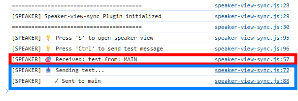

# Speaker-view-sync Extension For Quarto

- This is a sample plugin to send a message to/from the speaker view.
- Although the plugin itself is meaningless, you can extend this plugin to implement a plugin that synchronizes data between the main window and the speaker view.
  - e.g. laser pointer like powerpoint
  - This plugin just sends "test" from a window to another.


## Installing

```bash
quarto add herosi/speaker-view-sync
```

This will install the extension under the `_extensions` subdirectory.
If you're using version control, you will want to check in this directory.

## Using

1. Add this plugin to the front matter of a `.qmd` file or `_quarto.yaml`, as shown below.
   ``` yaml
   revealjs-plugins:
     - speaker-view-sync
   ```
2. Open the html rendered and the speaker view by pressing `S`
3. Press `Ctrl` on a window
4. The message will be displayed on a web browser console.
   - press `F12` to open it.
  



## Known Issue

If either window is reloaded, this plugin will no longer function correctly.
In that case, close the Speaker View, reload the main window, and then reopen the Speaker View.

## Example

Here is the source code for a minimal example: [example.qmd](example.qmd). View an example presentation at [example.html](https://herosi.github.io/speaker-view-sync/demo/example.html). Press `Ctrl` to send/receive the messages.


